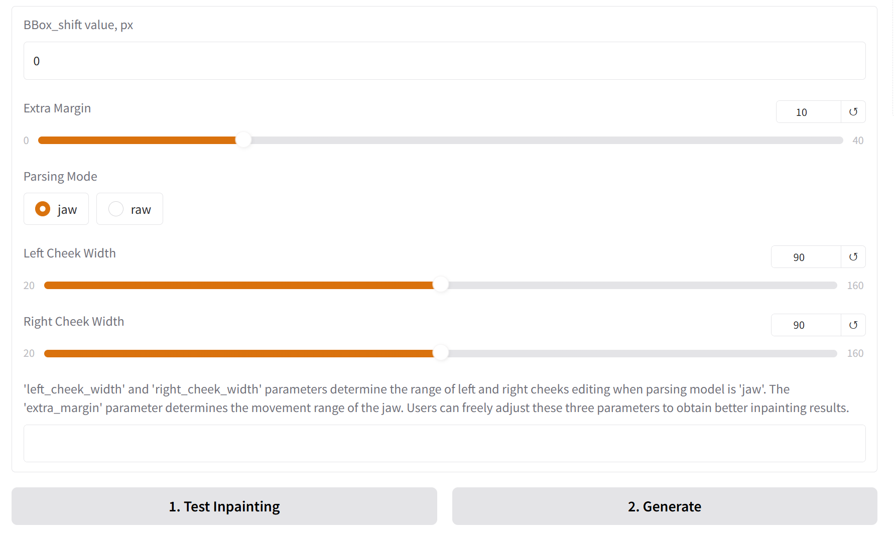
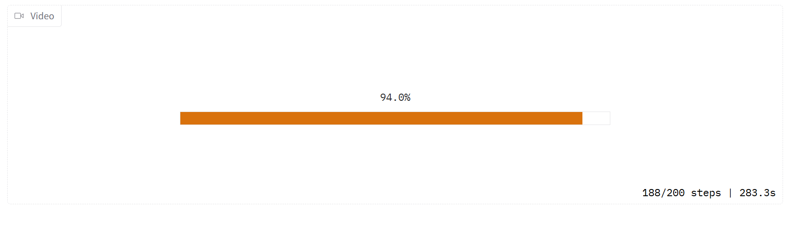

# MuseTalk

<strong>MuseTalk: Real-Time High-Fidelity Video Dubbing via Spatio-Temporal Sampling</strong>

Yue Zhang<sup>\*</sup>,
Zhizhou Zhong<sup>\*</sup>,
Minhao Liu<sup>\*</sup>,
Zhaokang Chen,
Bin Wu<sup>†</sup>,
Yubin Zeng, 
Chao Zhan,
Junxin Huang,
Yingjie He,
Wenjiang Zhou
(<sup>*</sup>Equal Contribution, <sup>†</sup>Corresponding Author, benbinwu@tencent.com)

Lyra Lab, Tencent Music Entertainment

**[github](https://github.com/TMElyralab/MuseTalk)**    **[huggingface](https://huggingface.co/TMElyralab/MuseTalk)**    **[space](https://huggingface.co/spaces/TMElyralab/MuseTalk)**    **[Technical report](https://arxiv.org/abs/2410.10122)**


# Getting Started
We provide a detailed tutorial about the installation and the basic usage of MuseTalk for new users:

## Third party integration
Thanks for the third-party integration, which makes installation and use more convenient for everyone.
We also hope you note that we have not verified, maintained, or updated third-party. Please refer to this project for specific results.

### [ComfyUI](https://github.com/chaojie/ComfyUI-MuseTalk)

## Installation
To prepare the Python environment and install additional packages such as opencv, diffusers, mmcv, etc., please follow the steps below:
### To setup on IITK GPU
* Start conda using the instruction given on gpu after logging in 
* eval "$(/srv/softs/anaconda3/bin/conda shell.bash hook)"
* conda init
* exec $SHELL //to restart shell
* Cd Shubh_007A
* conda create -n mypython python=3.10 -y
* conda activate mypython
* Conda activate my python
* python --version
* pip --version
Now install cuda 11.7
* wget https://developer.download.nvidia.com/compute/cuda/11.7.0/local_installers/cuda_11.7.0_515.43.04_linux.run
* sh cuda_11.7.0_515.43.04_linux.run --toolkit --silent --override --installpath=$HOME/cuda-11.7
* Add this to ~/.bashrc —:>
    *  export PATH=$HOME/cuda-11.7/bin:$PATH
    * export LD_LIBRARY_PATH=$HOME/cuda-11.7/lib64:$LD_LIBRARY_PATH
    * export CUDA_HOME=$HOME/cuda-11.7
    * Ex - (# CUDA 11.7 Paths
    * export CUDA_HOME=/scratch/work/Shubh_007A/cuda-11.7
    * export PATH=$CUDA_HOME/bin:$PATH
    * export LD_LIBRARY_PATH=$CUDA_HOME/lib64:$LD_LIBRARY_PATH )
* nvcc --version
* nvidia-smi
* echo $CUDA_HOME
🔧 Fix: Set Up SSL Correctly
* ls -l $SSL_CERT_FILE
* echo 'export SSL_CERT_FILE=$(python -m certifi)' >> ~/.bashrc
* echo 'export SSL_CERT_DIR=$(dirname $SSL_CERT_FILE)' >> ~/.bashrc
* source ~/.bashrc

Installing requirements 
From MuseTalk
* pip install -r requirements.txt
* !pip install --no-cache-dir -U openmim
* !mim install mmengine
* !mim install "mmcv==2.0.1"
* !mim install "mmdet>=3.1.0"
* !mim install "mmpose>=1.1.0"
* !pip uninstall huggingface_hub
* !pip install huggingface-hub==0.25.2
* conda install -c conda-forge ffmpeg
* Change share = True in app.py line 425
* python app.py //to install checkpoints for other models being used 
* For inference - python -m scripts.inference --inference_config configs/inference/test.yaml 
* Done dana done


* If gradio error - then pip install gradio
### Build environment
We recommend Python 3.10 and CUDA 11.7. Set up your environment as follows:

```shell
conda create -n MuseTalk python==3.10
conda activate MuseTalk
```

### Install PyTorch 2.0.1
Choose one of the following installation methods:

```shell
# Option 1: Using pip
pip install torch==2.0.1 torchvision==0.15.2 torchaudio==2.0.2 --index-url https://download.pytorch.org/whl/cu118

# Option 2: Using conda
conda install pytorch==2.0.1 torchvision==0.15.2 torchaudio==2.0.2 pytorch-cuda=11.8 -c pytorch -c nvidia
```

### Install Dependencies
Install the remaining required packages:

```shell
pip install -r requirements.txt
```

### Install MMLab Packages
Install the MMLab ecosystem packages:

```bash
pip install --no-cache-dir -U openmim
mim install mmengine
mim install "mmcv==2.0.1"
mim install "mmdet==3.1.0"
mim install "mmpose==1.1.0"
```

### Setup FFmpeg
1. [Download](https://github.com/BtbN/FFmpeg-Builds/releases) the ffmpeg-static package

2. Configure FFmpeg based on your operating system:

For Linux:
```bash
export FFMPEG_PATH=/path/to/ffmpeg
# Example:
export FFMPEG_PATH=/musetalk/ffmpeg-4.4-amd64-static
```

For Windows:
Add the `ffmpeg-xxx\bin` directory to your system's PATH environment variable. Verify the installation by running `ffmpeg -version` in the command prompt - it should display the ffmpeg version information.

### Download weights
You can download weights in two ways:

#### Option 1: Using Download Scripts
We provide two scripts for automatic downloading:

For Linux:
```bash
sh ./download_weights.sh
```

For Windows:
```batch
# Run the script
download_weights.bat
```

#### Option 2: Manual Download
You can also download the weights manually from the following links:

1. Download our trained [weights](https://huggingface.co/TMElyralab/MuseTalk/tree/main)
2. Download the weights of other components:
   - [sd-vae-ft-mse](https://huggingface.co/stabilityai/sd-vae-ft-mse/tree/main)
   - [whisper](https://huggingface.co/openai/whisper-tiny/tree/main)
   - [dwpose](https://huggingface.co/yzd-v/DWPose/tree/main)
   - [syncnet](https://huggingface.co/ByteDance/LatentSync/tree/main)
   - [face-parse-bisent](https://drive.google.com/file/d/154JgKpzCPW82qINcVieuPH3fZ2e0P812/view?pli=1)
   - [resnet18](https://download.pytorch.org/models/resnet18-5c106cde.pth)

Finally, these weights should be organized in `models` as follows:
```
./models/
├── musetalk
│   └── musetalk.json
│   └── pytorch_model.bin
├── musetalkV15
│   └── musetalk.json
│   └── unet.pth
├── syncnet
│   └── latentsync_syncnet.pt
├── dwpose
│   └── dw-ll_ucoco_384.pth
├── face-parse-bisent
│   ├── 79999_iter.pth
│   └── resnet18-5c106cde.pth
├── sd-vae
│   ├── config.json
│   └── diffusion_pytorch_model.bin
└── whisper
    ├── config.json
    ├── pytorch_model.bin
    └── preprocessor_config.json
    
```
## Quickstart

### Inference
We provide inference scripts for both versions of MuseTalk:

#### Prerequisites
Before running inference, please ensure ffmpeg is installed and accessible:
```bash
# Check ffmpeg installation
ffmpeg -version
```
If ffmpeg is not found, please install it first:
- Windows: Download from [ffmpeg-static](https://github.com/BtbN/FFmpeg-Builds/releases) and add to PATH
- Linux: `sudo apt-get install ffmpeg`

#### Normal Inference
##### Linux Environment
```bash
# MuseTalk 1.5 (Recommended)
sh inference.sh v1.5 normal

# MuseTalk 1.0
sh inference.sh v1.0 normal
```

##### Windows Environment

Please ensure that you set the `ffmpeg_path` to match the actual location of your FFmpeg installation.

```bash
# MuseTalk 1.5 (Recommended)
python -m scripts.inference --inference_config configs\inference\test.yaml --result_dir results\test --unet_model_path models\musetalkV15\unet.pth --unet_config models\musetalkV15\musetalk.json --version v15 --ffmpeg_path ffmpeg-master-latest-win64-gpl-shared\bin

# For MuseTalk 1.0, change:
# - models\musetalkV15 -> models\musetalk
# - unet.pth -> pytorch_model.bin
# - --version v15 -> --version v1
```

#### Real-time Inference
##### Linux Environment
```bash
# MuseTalk 1.5 (Recommended)
sh inference.sh v1.5 realtime

# MuseTalk 1.0
sh inference.sh v1.0 realtime
```

##### Windows Environment
```bash
# MuseTalk 1.5 (Recommended)
python -m scripts.realtime_inference --inference_config configs\inference\realtime.yaml --result_dir results\realtime --unet_model_path models\musetalkV15\unet.pth --unet_config models\musetalkV15\musetalk.json --version v15 --fps 25 --ffmpeg_path ffmpeg-master-latest-win64-gpl-shared\bin

# For MuseTalk 1.0, change:
# - models\musetalkV15 -> models\musetalk
# - unet.pth -> pytorch_model.bin
# - --version v15 -> --version v1
```

The configuration file `configs/inference/test.yaml` contains the inference settings, including:
- `video_path`: Path to the input video, image file, or directory of images
- `audio_path`: Path to the input audio file

Note: For optimal results, we recommend using input videos with 25fps, which is the same fps used during model training. If your video has a lower frame rate, you can use frame interpolation or convert it to 25fps using ffmpeg.

Important notes for real-time inference:
1. Set `preparation` to `True` when processing a new avatar
2. After preparation, the avatar will generate videos using audio clips from `audio_clips`
3. The generation process can achieve 30fps+ on an NVIDIA Tesla V100
4. Set `preparation` to `False` for generating more videos with the same avatar

For faster generation without saving images, you can use:
```bash
python -m scripts.realtime_inference --inference_config configs/inference/realtime.yaml --skip_save_images
```

## Gradio Demo
We provide an intuitive web interface through Gradio for users to easily adjust input parameters. To optimize inference time, users can generate only the **first frame** to fine-tune the best lip-sync parameters, which helps reduce facial artifacts in the final output.

For minimum hardware requirements, we tested the system on a Windows environment using an NVIDIA GeForce RTX 3050 Ti Laptop GPU with 4GB VRAM. In fp16 mode, generating an 8-second video takes approximately 5 minutes. 

Both Linux and Windows users can launch the demo using the following command. Please ensure that the `ffmpeg_path` parameter matches your actual FFmpeg installation path:

```bash
# You can remove --use_float16 for better quality, but it will increase VRAM usage and inference time
python app.py --use_float16 --ffmpeg_path ffmpeg-master-latest-win64-gpl-shared\bin
```

## Training

### Data Preparation
To train MuseTalk, you need to prepare your dataset following these steps:

1. **Place your source videos** 

   For example, if you're using the HDTF dataset, place all your video files in `./dataset/HDTF/source`.

2. **Run the preprocessing script**
   ```bash
   python -m scripts.preprocess --config ./configs/training/preprocess.yaml
   ```
   This script will:
   - Extract frames from videos
   - Detect and align faces
   - Generate audio features
   - Create the necessary data structure for training

### Training Process
After data preprocessing, you can start the training process:

1. **First Stage**
   ```bash
   sh train.sh stage1
   ```

2. **Second Stage**
   ```bash
   sh train.sh stage2
   ```

### Configuration Adjustment
Before starting the training, you should adjust the configuration files according to your hardware and requirements:

1. **GPU Configuration** (`configs/training/gpu.yaml`):
   - `gpu_ids`: Specify the GPU IDs you want to use (e.g., "0,1,2,3")
   - `num_processes`: Set this to match the number of GPUs you're using

2. **Stage 1 Configuration** (`configs/training/stage1.yaml`):
   - `data.train_bs`: Adjust batch size based on your GPU memory (default: 32)
   - `data.n_sample_frames`: Number of sampled frames per video (default: 1)

3. **Stage 2 Configuration** (`configs/training/stage2.yaml`):
   - `random_init_unet`: Must be set to `False` to use the model from stage 1
   - `data.train_bs`: Smaller batch size due to high GPU memory cost (default: 2)
   - `data.n_sample_frames`: Higher value for temporal consistency (default: 16)
   - `solver.gradient_accumulation_steps`: Increase to simulate larger batch sizes (default: 8)
  

### GPU Memory Requirements
Based on our testing on a machine with 8 NVIDIA H20 GPUs:

#### Stage 1 Memory Usage
| Batch Size | Gradient Accumulation | Memory per GPU | Recommendation |
|:----------:|:----------------------:|:--------------:|:--------------:|
| 8          | 1                      | ~32GB          |                |
| 16         | 1                      | ~45GB          |                |
| 32         | 1                      | ~74GB          | ✓              |

#### Stage 2 Memory Usage
| Batch Size | Gradient Accumulation | Memory per GPU | Recommendation |
|:----------:|:----------------------:|:--------------:|:--------------:|
| 1          | 8                      | ~54GB          |                |
| 2          | 2                      | ~80GB          |                |
| 2          | 8                      | ~85GB          | ✓              |

<details close>
## TestCases For 1.0
<table class="center">
  <tr style="font-weight: bolder;text-align:center;">
        <td width="33%">Image</td>
        <td width="33%">MuseV</td>
        <td width="33%">+MuseTalk</td>
  </tr>
  <tr>
    <td>
      
    </td>
    <td >
      <video src=https://github.com/TMElyralab/MuseTalk/assets/163980830/4a4bb2d1-9d14-4ca9-85c8-7f19c39f712e controls preload></video>
    </td>
    <td >
      <video src=https://github.com/TMElyralab/MuseTalk/assets/163980830/b2a879c2-e23a-4d39-911d-51f0343218e4 controls preload></video>
    </td>
  </tr>
  <tr>
    <td>
      
    </td>
    <td >
      <video src=https://github.com/TMElyralab/MuseTalk/assets/163980830/57ef9dee-a9fd-4dc8-839b-3fbbbf0ff3f4 controls preload></video>
    </td>
    <td >
      <video src=https://github.com/TMElyralab/MuseTalk/assets/163980830/94d8dcba-1bcd-4b54-9d1d-8b6fc53228f0 controls preload></video>
    </td>
  </tr>
  <tr>
    <td>
      
    </td>
    <td >
      <video src=https://github.com/TMElyralab/MuseTalk/assets/163980830/5fbab81b-d3f2-4c75-abb5-14c76e51769e controls preload></video>
    </td>
    <td >
      <video src=https://github.com/TMElyralab/MuseTalk/assets/163980830/f8100f4a-3df8-4151-8de2-291b09269f66 controls preload></video>
    </td>
  </tr>
   <tr>
    <td>
      
    </td>
    <td >
      <video src=https://github.com/TMElyralab/MuseTalk/assets/163980830/a6e7d431-5643-4745-9868-8b423a454153 controls preload></video>
    </td>
    <td >
      <video src=https://github.com/TMElyralab/MuseTalk/assets/163980830/6ccf7bc7-cb48-42de-85bd-076d5ee8a623 controls preload></video>
    </td>
  </tr>
  <tr>
    <td>
      
    </td>
    <td >
      <video src=https://github.com/TMElyralab/MuseTalk/assets/163980830/1568f604-a34f-4526-a13a-7d282aa2e773 controls preload></video>
    </td>
    <td >
      <video src=https://github.com/TMElyralab/MuseTalk/assets/163980830/a40784fc-a885-4c1f-9b7e-8f87b7caf4e0 controls preload></video>
    </td>
  </tr>
  <tr>
    <td>
      
    </td>
    <td >
      <video src=https://github.com/TMElyralab/MuseTalk/assets/163980830/37a3a666-7b90-4244-8d3a-058cb0e44107 controls preload></video>
    </td>
    <td >
      <video src=https://github.com/TMElyralab/MuseTalk/assets/163980830/172f4ff1-d432-45bd-a5a7-a07dec33a26b controls preload></video>
    </td>
  </tr>
  <tr>
    <td>
      
    </td>
    <td >
      <video src=https://github.com/TMElyralab/MuseTalk/assets/163980830/37a3a666-7b90-4244-8d3a-058cb0e44107 controls preload></video>
    </td>
    <td >
      <video src=https://github.com/TMElyralab/MuseTalk/assets/163980830/85a6873d-a028-4cce-af2b-6c59a1f2971d controls preload></video>
    </td>
  </tr>
</table >

#### Use of bbox_shift to have adjustable results(For 1.0)
:mag_right: We have found that upper-bound of the mask has an important impact on mouth openness. Thus, to control the mask region, we suggest using the `bbox_shift` parameter. Positive values (moving towards the lower half) increase mouth openness, while negative values (moving towards the upper half) decrease mouth openness.

You can start by running with the default configuration to obtain the adjustable value range, and then re-run the script within this range. 

For example, in the case of `Xinying Sun`, after running the default configuration, it shows that the adjustable value rage is [-9, 9]. Then, to decrease the mouth openness, we set the value to be `-7`. 
```
python -m scripts.inference --inference_config configs/inference/test.yaml --bbox_shift -7 
```
:pushpin: More technical details can be found in [bbox_shift](assets/BBOX_SHIFT.md).


# Acknowledgement
1. We thank open-source components like [whisper](https://github.com/openai/whisper), [dwpose](https://github.com/IDEA-Research/DWPose), [face-alignment](https://github.com/1adrianb/face-alignment), [face-parsing](https://github.com/zllrunning/face-parsing.PyTorch), [S3FD](https://github.com/yxlijun/S3FD.pytorch) and [LatentSync](https://huggingface.co/ByteDance/LatentSync/tree/main). 
1. MuseTalk has referred much to [diffusers](https://github.com/huggingface/diffusers) and [isaacOnline/whisper](https://github.com/isaacOnline/whisper/tree/extract-embeddings).
1. MuseTalk has been built on [HDTF](https://github.com/MRzzm/HDTF) datasets.

Thanks for open-sourcing!

# Limitations
- Resolution: Though MuseTalk uses a face region size of 256 x 256, which make it better than other open-source methods, it has not yet reached the theoretical resolution bound. We will continue to deal with this problem.  
If you need higher resolution, you could apply super resolution models such as [GFPGAN](https://github.com/TencentARC/GFPGAN) in combination with MuseTalk.

- Identity preservation: Some details of the original face are not well preserved, such as mustache, lip shape and color.

- Jitter: There exists some jitter as the current pipeline adopts single-frame generation.

# Citation
```bib
@article{musetalk,
  title={MuseTalk: Real-Time High-Fidelity Video Dubbing via Spatio-Temporal Sampling},
  author={Zhang, Yue and Zhong, Zhizhou and Liu, Minhao and Chen, Zhaokang and Wu, Bin and Zeng, Yubin and Zhan, Chao and He, Yingjie and Huang, Junxin and Zhou, Wenjiang},
  journal={arxiv},
  year={2025}
}
